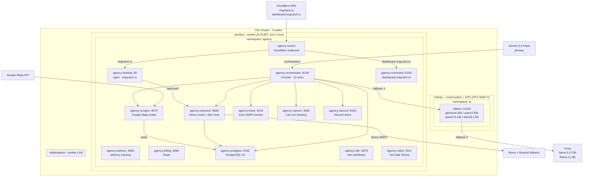

# RingCatch Agency

**AI chatbot agency for US local SMBs - 24 services on k3s**

RingCatch sells AI chatbots to local small businesses: HVAC companies, plumbers, electricians, dental offices, auto repair shops, law firms. $450 setup + $89/month recurring. Fully automated from lead discovery through client onboarding - the orchestrator AI brain runs the entire pipeline autonomously with Mike as the only human in the loop.

**Business:** Sprint goal 3 paying clients by 2026-06-01. ~1,271 outreach emails sent. Revenue target: $10k MRR.

---

## Architecture

24 services run as k3s Deployments in the `agency` namespace, all pinned to archbox. LLM inference is served by Ollama on mikepc (RTX 5060 Ti GPU) with a 4-tier cloud fallback chain.



---

## k3s Infrastructure

All 24 agency services run on archbox via `nodeSelector: kubernetes.io/hostname: archbox`. The full cluster has 3 nodes:

| Node | Role | LAN IP | Tailscale IP | Hardware |
|---|---|---|---|---|
| **mikepc** | Control plane | 192.168.4.54 | 100.97.45.57 | RTX 5060 Ti, Debian 13 |
| **archbox** | Worker - all agency services | 192.168.4.46 | 100.96.122.27 | i3-4130T, Arch Linux |
| **mikeinspiron** | Worker (LAN only) | 192.168.4.33 | - | Inspiron, Debian 13 |

**Manifests:** `~/homelab-infra/k8s/agency.yaml` on mikepc - 24 Deployments + Services + PVCs

**Ingress:** Cloudflare tunnel (`agency-tunnel`) handles all public traffic - no open ports on archbox. The tunnel routes `ringcatch.io` to `agency-landing:80` and `dashboard.ringcatch.io` to `agency-command:8100`.

**Images:** Custom agency images are `localhost/agency-*:latest` stored in k3s containerd on archbox - not in any registry. Must be built with Podman and imported manually after each code change.

---

## LLM Routing

The orchestrator uses a 4-tier fallback chain for maximum uptime:

```
Gemini 2.5 Flash       -- primary: fast, long context, cheap
    |
    v (fallback)
Ollama gemma4:26b      -- local GPU on mikepc, private, no token cost
    |
    v (fallback)
Groq llama-3.3-70b     -- fast cloud inference
    |
    v (fallback)
Groq llama-3.1-8b      -- speed-optimized, last resort
```

The Alex sales chatbot uses `qwen2.5:14b` for tool-calling decisions and `llama3.1:8b` for fast response generation (native tool support).

Ollama endpoint from archbox: `http://100.97.45.57:11434`

---

## Stack

| Layer | Choice |
|---|---|
| **Orchestration** | k3s v1.35 - `agency` namespace, all 24 pods pinned to archbox |
| **Database** | PostgreSQL 16 (k3s PVC, hostPath to existing Podman volume data) |
| **LLM primary** | Gemini 2.5 Flash via Gemini API |
| **LLM fallback** | Ollama gemma4:26b on mikepc RTX 5060 Ti - `http://100.97.45.57:11434` |
| **LLM cloud fallback** | Groq llama-3.3-70b-versatile / llama-3.1-8b-instant |
| **Chat model** | qwen2.5:14b (tool calls) + llama3.1:8b (Alex persona, fast) |
| **Email** | Brevo (primary SMTP) + Resend (automatic fallback) |
| **Leads** | Google Maps API - scraper targets niche + city combinations |
| **Booking** | Cal.com (agency-calcom :3000) |
| **Automation** | n8n (agency-n8n :5678) |
| **Public ingress** | Cloudflare tunnel - no open firewall ports |
| **Voice/TTS** | Kokoro TTS (agency-kokoro) + Speaches (agency-voice) |
| **Video** | YouTube Short generation - 25-niche rotation, nightly 2 AM cron |

---

## Services

### Lead Pipeline

| Service | Port | Role |
|---|---|---|
| **agency-scraper** | 8079 | Google Maps lead scraper - targets by niche + city, writes to PostgreSQL |
| **agency-outreach** | 8080 | Brevo email outreach + Alex chatbot (`/chat/start`, `/chat/message`) |
| **agency-delivery** | 8081 | Email delivery tracking + bounce/click webhook handler |

The scraper pulls business leads from Google Maps by niche (HVAC, plumbers, electricians, dental, auto repair, law firms, insurance, cleaning, landscaping) and US city. Outreach sends personalized cold emails via Brevo with Resend as automatic fallback. The `agency-landing` nginx proxy forwards `/api/chat/*` to outreach so the Alex chatbot runs on ringcatch.io.

**Alex persona:** The outreach service hosts an AI sales chatbot named Alex. Alex answers questions about the product, handles objections, and books discovery calls via Cal.com. Pricing: $450 setup + $89/month ($890/year option). Floor: never below $69/month.

### Orchestrator (AI Brain)

| Service | Port | Role |
|---|---|---|
| **agency-orchestrator** | 8109 | FastAPI - 22 tools, autonomous pipeline driver, 6-hour health reports |

The orchestrator monitors the full pipeline, triggers scrapes, sends outreach batches, processes inbox replies, and manages client workflows. Sends health report emails to Mike and Gergana every 6 hours. Has 22 FastAPI tool endpoints callable by the LLM.

**Important:** `set_pricing_mode` requires Mike's explicit approval - never called autonomously.

### Operations + Dashboard

| Service | Port | Role |
|---|---|---|
| **agency-command** | 8100 | Internal command center - dashboard.ringcatch.io (Cloudflare tunnel) |
| **agency-inbox** | 8110 | Zoho IMAP monitor - watches for email replies, routes to orchestrator |
| **agency-billing** | 8082 | Stripe billing + subscription lifecycle management |
| **agency-discord** | 8103 | Discord bot bridge - sends orchestrator alerts to Mike |

### Business Intelligence + Client Success

| Service | Port | Role |
|---|---|---|
| **agency-bi** | 8106 | Business intelligence - pipeline metrics, conversion analytics |
| **agency-sales** | 8107 | Sales pipeline tracker - lead stages, follow-up scheduling |
| **agency-cfo** | 8108 | CFO / financial reporting - MRR tracking, cash flow |
| **agency-success** | 8105 | Customer success - onboarding, health scoring |
| **agency-support** | 8104 | Tech support monitor - client issue triage |
| **agency-marketing** | 8102 | Marketing automation |
| **agency-legal** | 8101 | Legal document service - contracts, ToS |

### Content + Voice

| Service | Port | Role |
|---|---|---|
| **agency-video** | 8111 | YouTube Short generation - 25-niche rotation, nightly 2 AM, 7-day cleanup |
| **agency-dashboard** | 8501 | Streamlit analytics dashboard |
| **agency-kokoro** | 8080 | Kokoro TTS voice synthesis |
| **agency-voice** | 8000 | Speaches voice service |

### Infrastructure

| Service | Port | Role |
|---|---|---|
| **agency-postgres** | 5432 | PostgreSQL 16 (PVC hostPath to pre-existing Podman data volume) |
| **agency-n8n** | 5678 | n8n workflow automation |
| **agency-calcom** | 3000 | Cal.com scheduling - Alex books demo calls here |
| **agency-landing** | 80 | ringcatch.io nginx - static site + `/api` proxy to outreach |
| **agency-tunnel** | - | Cloudflare tunnel outbound connector (no open ports needed) |

---

## Deployment

### Rebuild and redeploy a service

Custom images live in k3s containerd on archbox only - not in a registry. Three-step deploy after any code change:

```fish
# 1. Build on archbox
ssh archbox
cd ~/agency/<service>
podman build -t localhost/agency-<service>:latest .

# 2. Import into k3s containerd on archbox
podman save localhost/agency-<service>:latest | sudo k3s ctr -n k8s.io images import -

# 3. Restart from control plane (kubectl must run on mikepc)
ssh mikepc
kubectl rollout restart deployment/agency-<service> -n agency
kubectl logs -n agency deployment/agency-<service> --tail=20
```

### Check service health

```fish
# From mikepc (control plane only - kubectl does not run on archbox or mikeinspiron)
kubectl get pods -n agency
kubectl get pods -n agency | grep -v Running       # show unhealthy only
kubectl describe pod -n agency <pod-name>          # debug a stuck pod
```

### Full namespace restart

```fish
# From mikepc
kubectl rollout restart deployment -n agency
```

### Apply manifest changes

```fish
# From mikepc - after editing ~/homelab-infra/k8s/agency.yaml
kubectl apply -f ~/homelab-infra/k8s/agency.yaml
```

### Secrets

All secrets in `~/agency/.env` on archbox - never committed to git. Loaded as k8s Secret `agency-env` in the `agency` namespace, injected as environment variables into every container via `envFrom`.

Contains: Brevo API key, Resend API key, Gemini API key, Groq API key, Google Maps API key, Stripe keys, Zoho IMAP credentials, Cal.com token, Cloudflare tunnel token.

---

## Public Access

| URL | Route |
|---|---|
| `ringcatch.io` | Cloudflare tunnel -> `agency-landing:80` (nginx static + /api proxy) |
| `dashboard.ringcatch.io` | Cloudflare tunnel -> `agency-command:8100` |

Nginx on `agency-landing` proxies `/api/chat/*` and `/api/track` to `agency-outreach:8080`. All other paths serve the static ringcatch.io site.

Tunnel ID: `2ef09425-ed87-4c07-a0e4-ecca2041dcdf`

---

## Key Files

```
~/agency/
├── .env                        # all secrets (never commit)
├── CLAUDE.md                   # Claude Code context for this project
├── orchestrator/main.py        # AI brain - 22 FastAPI tools, LLM routing, health reports
├── outreach/main.py            # Brevo outreach + /chat/start, /chat/message (Alex persona)
├── landing/
│   ├── nginx.conf              # proxy: /api/chat/* and /api/track -> outreach:8080
│   ├── index.html              # ringcatch.io public landing page
│   └── book.html               # Alex chatbot booking page
├── scraper/main.py             # Google Maps lead scraper
├── video/main.py               # YouTube Short generation (nightly 2 AM, 25-niche rotation)
└── knowledge/                  # markdown KB articles injected into orchestrator LLM context

~/homelab-infra/k8s/
└── agency.yaml                 # full k8s manifest: 24 Deployments + Services + PVCs
```

---

*All pricing changes require Mike's explicit approval. `set_pricing_mode` is never called autonomously.*
