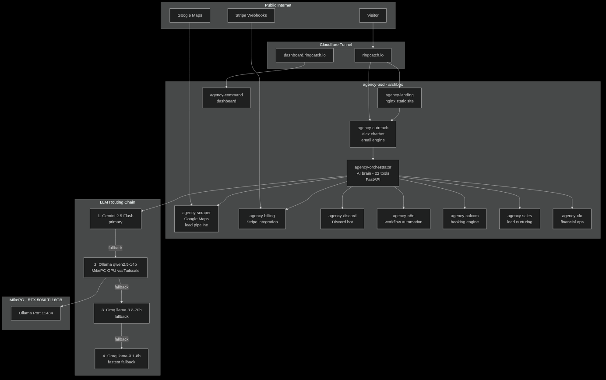

# RingCatch Agency

**AI chatbot agency platform — 24 services on k3s**

AI chatbots for US-based small businesses. $450 setup + $89/month. Fully automated lead capture, outreach, booking, and client success.



---

## Stack

| Layer | Choice |
|---|---|
| **Orchestration** | k3s (Kubernetes) — `agency` namespace, all pods on archbox |
| **Database** | PostgreSQL 16 (k3s PVC, hostPath to existing Podman volume data) |
| **LLM** | Ollama on mikepc (RTX 5060 Ti) — `http://100.97.45.57:11434` |
| **LLM routing** | Gemini 2.5 Flash → Ollama gemma4:26b → Groq llama-3.3-70b → Groq llama-3.1-8b |
| **Chat model** | `llama3.1:8b` (Alex persona, fast) |
| **Email** | Brevo + Resend fallback |
| **Leads** | Google Maps scraper → SMTP outreach |
| **Booking** | Cal.com |
| **Automation** | n8n |
| **Public ingress** | Cloudflare tunnel (no open ports) |

---

## Services

| Service | Port | Purpose |
|---|---|---|
| agency-orchestrator | 8109 | AI brain — FastAPI, 22 tools, LLM routing |
| agency-outreach | 8080 | Email outreach + /book sales chat (Alex persona) |
| agency-scraper | 8079 | Google Maps lead scraper |
| agency-landing | 80 | ringcatch.io public site (nginx, proxies /api/* to outreach) |
| agency-command | 8100 | Internal command center dashboard |
| agency-discord | 8103 | Discord bot bridge |
| agency-billing | 8082 | Billing + Stripe |
| agency-legal | 8101 | Legal document service |
| agency-marketing | 8102 | Marketing automation |
| agency-support | 8104 | Tech support monitor |
| agency-success | 8105 | Customer success |
| agency-bi | 8106 | Business intelligence |
| agency-sales | 8107 | Sales pipeline |
| agency-cfo | 8108 | CFO / financial reporting |
| agency-inbox | 8110 | Zoho IMAP inbox monitor |
| agency-delivery | 8081 | Email delivery tracking |
| agency-video | 8111 | YouTube Short generation |
| agency-dashboard | 8501 | Streamlit analytics dashboard |
| agency-postgres | 5432 | PostgreSQL 16 |
| agency-n8n | 5678 | n8n workflow automation |
| agency-calcom | 3000 | Cal.com scheduling |
| agency-kokoro | 8080 | Kokoro TTS |
| agency-voice | 8000 | Speaches voice service |
| agency-tunnel | — | Cloudflare tunnel (outbound only) |

---

## Deployment

All services run as k3s Deployments in the `agency` namespace, pinned to archbox.
Manifests: `~/homelab-infra/k8s/agency.yaml`

### Rebuild and redeploy a service

```bash
# On archbox
cd ~/agency/<service>
podman build -t localhost/agency-<service>:latest .
podman save localhost/agency-<service>:latest | sudo k3s ctr -n k8s.io images import -

# From mikepc (control plane)
kubectl rollout restart deployment/agency-<service> -n agency
kubectl logs -n agency deployment/agency-<service> --tail=20
```

### Check service health

```bash
# From mikepc
kubectl get pods -n agency
kubectl get pods -n agency | grep -v Running   # show unhealthy pods
```

### Secrets

All secrets in `~/agency/.env` on archbox — never committed to git. Loaded as k8s Secret `agency-env` in the `agency` namespace.

---

## Public access

- **ringcatch.io** → Cloudflare tunnel → `agency-landing:80` (nginx serves static site, proxies `/api/chat/*` and `/api/track` to `agency-outreach:8080`)
- **dashboard.ringcatch.io** → Cloudflare tunnel → `agency-command:8100`
- Tunnel ID: `2ef09425-ed87-4c07-a0e4-ecca2041dcdf`

---

## Key files

```
~/agency/
├── .env                        # all secrets (never commit)
├── orchestrator/main.py        # AI brain — 22 FastAPI tools
├── outreach/main.py            # email + /chat/start, /chat/message endpoints
├── landing/
│   ├── nginx.conf              # proxy rules: /api/chat/* → agency-outreach:8080
│   ├── index.html              # ringcatch.io landing page
│   └── book.html               # Alex chatbot booking page
├── scraper/main.py             # Google Maps lead scraper
├── video/main.py               # YouTube Short generation
└── knowledge/                  # markdown KB (injected into LLM prompts)

~/homelab-infra/k8s/
└── agency.yaml                 # full k8s manifest (24 Deployments + Services + PVCs)
```
